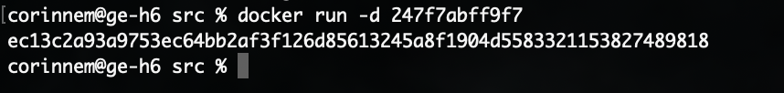

# REPORT
## Part 1. Готовый докер
- Выкачка docker-образа nginx:\

- Проверка наличия образа:\

- Запуск образа:\

- Проверка запуска образа:\

- Вызов команды `docker inspect determined_newton`:
    - Размер контейнера: "ShmSize": 67108864
    - Список замапленных портов: "80/tcp": null
    - Ip контейнера: "IPAddress": "172.17.0.3"
- Остановка образа:\

- Проверка остановки:\

- Запуск с портами 80 и 443:\

- localhost:80:\

- Перезапуск контейнера:\

- Проверка запуска контейнера:\

## Part 2. Операции с контейнером
- Содержимое файла nginx.conf:\

- Создание на локальной машине файла nginx.conf:\

- Настройка /status:\

- Копирование nginx.conf:\

- Перезапуск nginx:\

- Страница со статусом:\

- Экспорт контейнера:\

- Остановка контейнера:\

- Удаление образа, не удаляя перед этим контейнеры:\

- Удаление остановленного контейнера:\

- Импорт контейнера:\

- Запуск импортированного контейнера:\

- Проверка адреса localhost:80/status:\

## Part 3. Мини веб-сервер
- Команды для установки необходимого: `apt update; apt install gcc -y; apt install spawn-fcgi -y; apt install libfcgi-dev -y; apt install vim -y`
- Мини-сервер:\

- Страница localhost:81:\

## Part 4. Свой докер
- Сбор исходников:\

- Запуск и `docker build`:\

- Проверка `docker images`:\

- Проверка мини-сервера:\

- Перезапуск:\

- Статус сервера:\

## Part 5. Dockle
- dockerfile:\

- `build` и `dockle`:\

## Part 6. Базовый Docker Compose
- Поднятие контейнера:\

- Остановка контейнеров:\

- Вывод:\

- docker-compose.yml:\
